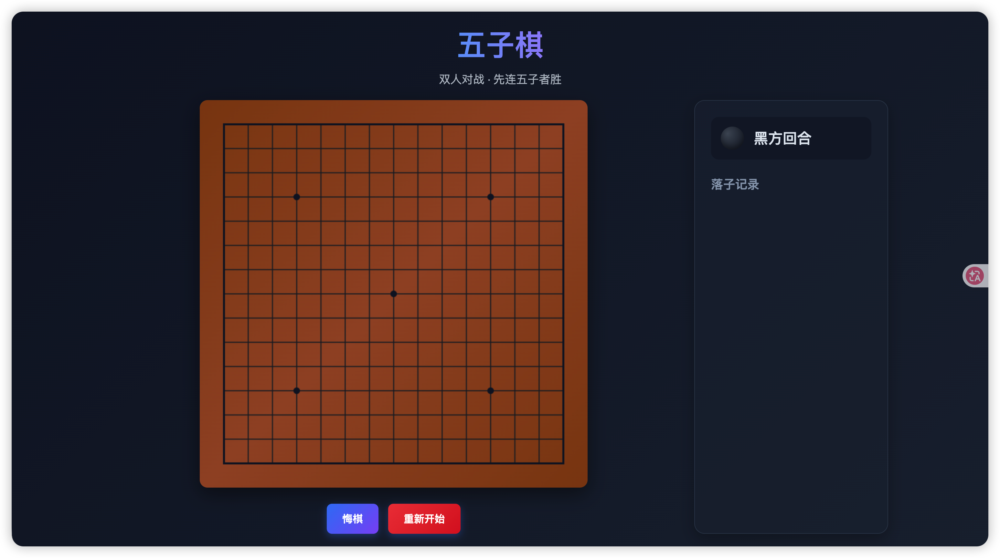

# ai-quickstart


本项目旨在可以快速搭建 DeepSeek 等 AI 大模型的 API 调用基础环境及代码。

> [!note]
>
> 本项目需均在具有相应大模型 API 的情况下使用。

## 安装依赖

### pip 安装

```sh
pip install -r requirements.txt
```

### conda 安装

```sh
# 在此使用的为 mamba

# 通过文件直接创建环境
mamba env create -f environment.yml

# 可通过 -n 指定环境名
mamba env create -f environment.yml -n 新环境名

# 更新现有环境
mamba env update -f environment.yml -n 环境名
```

## DeepSeek

首先需在 .env 文件中填入对应的 API，之后就可运行实例代码，实例代码的主要内容是根据提示词生成一个五子棋游戏。

```sh
DEEPSEEK_API_KEY=
```

提示此内容如下：

```
请创建一个现代风格的五子棋游戏，保存在单个 HTML 文件中。
设计要求：
1. UI 风格：深色极简主题（Dark Mode），背景使用深蓝色或深灰色渐变。
2. 棋盘：使用 Canvas 绘制，具有逼真的木质质感或高对比度网格。
3. 交互：棋子要有 CSS 阴影和渐变使其看起来有立体感。
4. 功能：双人对战模式，必须包含"悔棋"和"重新开始"按钮，获胜时弹出美观的模态框（Modal）提示。
5. 代码格式：请尽量紧凑，确保在单次回答中能生成完整的代码。
注意：请只提供代码，不要添加 Markdown 标记。
```

运行代码后生成的内容如下：


